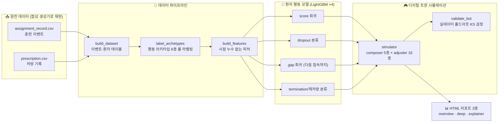
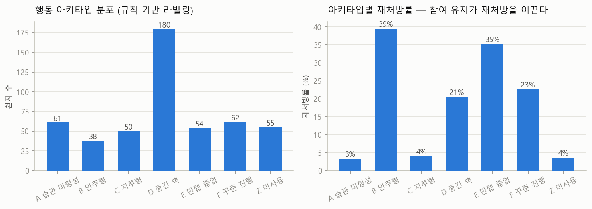
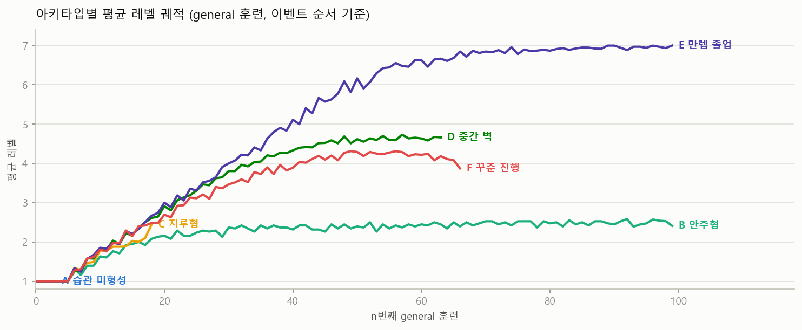
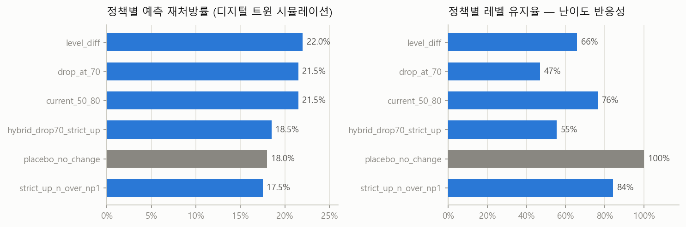

<div align="center">

# 🧠 DTx 인지훈련 난이도 조정 봇

**실사용 데이터 기반 디지털 트윈 시뮬레이터로, 인지훈련 앱의 난이도 조정 정책 16종을 오프라인에서 비교·평가**


</div>

> **🔒 데이터 거버넌스** — 이 저장소에는 **실제 환자 데이터, 학습된 모델, 실데이터 리포트가 일절 포함되어 있지 않습니다.**
> 원본은 국내 디지털 치료기기(DTx) 인지훈련 제품의 실사용 데이터(약 22만 훈련 이벤트, 처방 866건)로 개발되었고,
> 여기서는 동일 스키마의 **합성 데이터 생성기**(`data/make_synthetic.py`)로 전체 파이프라인을 재현합니다.
> 아래 차트는 모두 합성 데이터로 재생성한 것이며, 모델 성능 표에만 실데이터 기준 수치를 병기했습니다.

---

## 1. 문제

병원에서 인지훈련 앱을 처방하면 환자는 12주 동안 훈련을 수행합니다. 앱의 현행 난이도 규칙은 단순합니다.

> 최근 3회 점수 평균이 **80% 이상이면 레벨 ↑**, **50% 미만이면 레벨 ↓**, 그 외 유지.

실사용 데이터 분석 결과 이 규칙은 **레벨 유지율이 85%에 달할 만큼 반응이 느렸고**, 상당수 환자가
레벨 4–5 구간의 "중간 벽"에 정체된 채 이탈했습니다. 문제는 — **새 난이도 규칙을 실제 환자에게 바로
A/B 테스트할 수 없다**는 것(의료기기 소프트웨어). 그래서 오프라인 정책 평가 환경을 만들었습니다.

## 2. 접근: 환자 디지털 트윈 시뮬레이터

실사용 로그로 환자 행동 모델 4종(LightGBM)을 학습하고, 그 위에서 가상 환자 코호트가 12주 처방
기간을 살아가게 합니다. 난이도 조정 정책(**adjuster** 16종)과 세션 구성 정책(**composer** 5종)을
갈아 끼우며 재처방률·이탈률·레벨 진행을 비교합니다.



## 3. 핵심 결과

### 환자는 6가지 행동 패턴으로 나뉜다

ML 클러스터링 대신 **해석 가능한 룰 기반 아키타입**을 설계했습니다 (임상팀과 커뮤니케이션 가능해야 하므로).
참여를 유지한 그룹(B 안주형, E 만렙 졸업)의 재처방률이 뚜렷하게 높습니다 — *난이도 정책의 목표는
결국 참여 유지*라는 근거.





### 난이도 정책을 실환자 없이 비교한다

같은 가상 코호트에 정책만 바꿔 적용합니다. `placebo_no_change`(레벨 고정) 같은 **통제군 정책**을 함께
돌려서 시뮬레이터 자체의 편향을 감시합니다. 유지율(반응성)과 재처방률(성과)을 함께 보며 트레이드오프를
평가합니다.



### 시뮬레이터를 믿을 수 있는가?

- **홀드아웃 검증**: 시뮬레이션 코호트와 실데이터 홀드아웃의 지표 분포를 **KS 검정**으로 비교 (`validate_bot`)
- **통제군 정책**: placebo / easy-mode / hard-mode / random-walk가 상식적 순서로 나오는지 확인
- **과적합 감사**: `audit_models`가 train/test 격차, 피처 중요도 쏠림, 누수 의심 피처를 점검
- **캘리브레이션**: 아키타입 분포를 앵커로 termination 확률 보정 (`calibration.py`)

## 4. 모델 성능

| 모델 | 태스크 | 실데이터 (22만 이벤트) | 합성 데이터 (5만 이벤트) |
|---|---|---|---|
| **score** | 다음 훈련 점수 회귀 | MAE **0.167** (베이스라인 0.233) | MAE 0.070 (베이스라인 0.154) |
| **dropout** | 세션 후 이탈 분류 | ROC-AUC **0.964** | ROC-AUC 0.976 |
| **gap** | 다음 접속까지 일수 회귀 | MAE(log) **0.134** | MAE(log) 0.272 |
| **termination** | 재처방 여부 분류 | ROC-AUC **0.994** · PR-AUC 0.966 | ROC-AUC 0.654 |

> 합성 데이터는 구조 재현이 목적이라 실데이터와 수치가 다릅니다 (특히 termination은 합성 생성기의
> 재처방 규칙이 단순해 신호가 약함).

## 5. Quickstart

```bash
pip install -r requirements.txt

python data/make_synthetic.py        # 1) 합성 샘플 데이터 생성 (~5만 이벤트)
python -m bot.build_dataset          # 2) 이벤트/환자 테이블
python -m bot.label_archetypes       # 3) 행동 아키타입 라벨링
python -m bot.build_features         # 4) 피처 (시점 누수 방지)
python -m bot.train_models           # 5) LightGBM 4종 학습
python -m bot.validate_bot           # 6) 시뮬레이터 검증 (KS)
python -m bot.simulator --n 300      # 7) 정책 비교 시뮬레이션
python -m bot.make_report --n 200 --seeds 5   # 8) HTML 리포트
python docs/make_charts.py           # (README 차트 재생성)
```

## 6. 코드 맵

| 모듈 | 역할 |
|---|---|
| `bot/build_dataset.py` | 원천 CSV → 이벤트·환자 테이블 (불량 타임스탬프 복구 포함) |
| `bot/label_archetypes.py` | 행동 아키타입 6종 룰 라벨링 |
| `bot/build_features.py` | 시점 기준(as-of) 피처 생성 — 미래 정보 누수 차단 |
| `bot/train_models.py` / `tune_models.py` | LightGBM 4종 학습 / Optuna 튜닝 |
| `bot/audit_models.py` | 과적합·누수 감사 |
| `bot/algorithms.py` | **난이도 조정 정책 16종** (현행 + 제안 + 통제군) — 플러그인 구조 |
| `bot/composers.py` | 세션 구성 정책 5종 (랜덤 균형, 약점 집중, 아키타입 인지 등) |
| `bot/simulator.py` | 가상 코호트 시뮬레이션 (composer × adjuster 격자) |
| `bot/calibration.py` / `validate_bot.py` | 확률 보정 / KS 홀드아웃 검증 |
| `bot/make_*.py` | HTML 리포트 3종 (경영진용 overview, 분석 deep-dive, 비개발자용 explainer) |
| `data/make_synthetic.py` | 합성 샘플 데이터 생성기 (이 저장소의 유일한 데이터 소스) |

<details>
<summary><b>난이도 조정 정책 16종 목록</b></summary>

`current_50_80` (현행) · `drop_at_70` · `level_diff` · `strict_up_n_over_np1` · `expand_10_diff` ·
`hybrid_drop70_strict_up` · `narrow_maintain_65_75` · `adaptive_personal_baseline` · `aggressive_75_85` ·
`cliff_jump` · `slow_climb` · `single_score_floor` — 그리고 통제군: `placebo_no_change` ·
`easy_mode_down_only` · `hard_mode_up_only` · `random_walk`

새 정책은 `Algorithm` 서브클래스 하나로 추가됩니다 (`update_level_batch(levels, recent_scores)`).
</details>

---

<sub>이 저장소는 포트폴리오 열람용입니다. 실무 프로젝트에서 데이터·모델·내부 문서를 제거하고
합성 데이터로 재구성했습니다.</sub>
